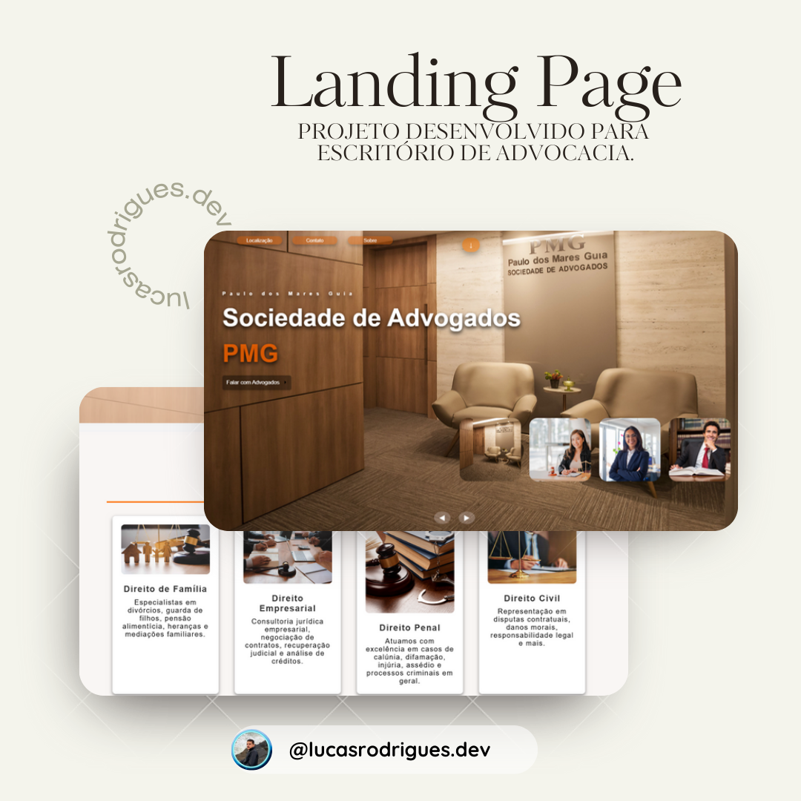

# Landing Page - Escritório de Advocacia ⚖️  

## 🛠 Sobre o Projeto  
Este projeto é uma landing page desenvolvida para um escritório de advocacia, com o objetivo de apresentar os serviços jurídicos de forma profissional e atraente. A página foi projetada para destacar a experiência e expertise da equipe, facilitar o contato com clientes e transmitir confiança.  

---

## 📸 Spoiler do Projeto

> Veja abaixo uma prévia da página:

---

## 🚀 Funcionalidades  
- **Seção de Serviços Jurídicos:** Apresentação detalhada das áreas de atuação, como Direito Civil, Trabalhista, Penal, e Empresarial.  
- **Equipe de Advogados:** Perfil dos advogados com informações sobre suas especializações.  
- **Depoimentos de Clientes:** Depoimentos reais que reforçam a credibilidade do escritório.  
- **Blog Jurídico:** Publicação de artigos com dicas e atualizações sobre leis e regulamentações.  
- **Formulário de Contato:** Envio direto de mensagens e agendamento de consultas.  
- **Botões de Ação (CTA):** Chamadas para ações como “Agendar Consulta” e “Fale com um Advogado”.  
- **Mapa Integrado:** Localização do escritório com Google Maps.  
- **Responsividade:** Design adaptado para todos os dispositivos (desktop, tablet, e mobile).  

---

## 📚 Tecnologias e Conceitos Utilizados  
- **HTML5:** Estruturação semântica do conteúdo da página.  
- **CSS3:** Estilização com design moderno, transições suaves e responsividade.  
- **JavaScript:** Funcionalidades dinâmicas para interatividade do usuário.  
- **Bootstrap:** Framework front-end para agilizar o desenvolvimento.  
- **Font Awesome:** Ícones personalizados para melhorar a estética da página.  
- **SEO:** Otimização para aumentar a visibilidade nos motores de busca.  

